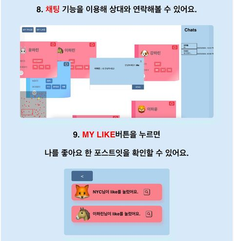

# Post it meeting
---
학교인증을 통한 교내 포스트잇 미팅 보드입니다.

사용자는 자신의 성별과 취미 MBTI 등을 입력할 수 있습니다.

사용자가 포스터를 등록하면 다른 사용자의 포스터를 볼 수 있습니다.

사용자가 다른 사용자의 포스터에 like를 보낼 수 있습니다.

사용자와 다른 사용자가 하트를 받으면, 서로 채팅이 가능합니다.

# How to Use

---
# Tech stack

### Back

### Front

